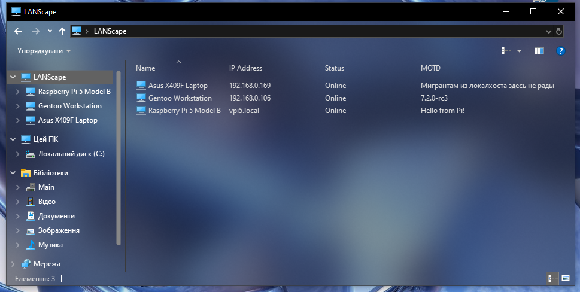

# LANScape

> Simple ØMQ-based LAN device discovery service for Windows and Linux with Explorer integration



---

## Overview

LANScape is a lightweight local network discovery system that allows computers on the same LAN to automatically discover each other.

Each machine broadcasts its presence over multicast. A local discovery client collects these broadcasts, caches online devices, and exposes the information to local applications.

On Windows, LANScape integrates directly into Windows Explorer through a custom Shell Namespace Extension, allowing discovered devices to appear like a virtual folder.

---

## Features

* Automatic LAN device discovery
* Simple JSON configuration file
* Configurable device information
  * Display name
  * IP address
  * MOTD (Message of the Day)
* Local IPC interface
* Windows Explorer Shell Extension

---

## Dependencies

- ZeroMQ (libzmq, cppzmq)
- nlohmann/json
- Windows COM
- Meson
- systemd

---

## Building and installation

### Linux

```bash
# cd /opt
# git clone https://github.com/paliichukvladyslav/LANScape.git
# cd LANScape
# meson build
# cd build
# cp ../config.json src/ -v
# cp registry/lanscape.service /etc/systemd/system -v
```

## Windows

```powershell
$ git clone https://github.com/paliichukvladyslav/LANScape.git
$ .\winbuild.ps1
$ cd build
$ .\registry\sidebar_install.reg
$ cp ..\config.json .\src\config.json
```

---

## Configuration

Example configuration:

```json
{
    "id": "gentoo-pc",
    "display_name": "Gentoo Workstation",
    "device_ip": "192.168.0.106",
    "click_action": "ssh://user@192.168.0.106",
    "icon_id": "linux_gentoo",
    "MOTD": "Welcome!"
}
```

## Project Status

This project is currently under active development.
Additional functionality and UI improvements are planned.

---

## License

MIT License
